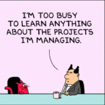

## Introduction
Throughout this course we focused on building web applications, but in the process I realized that software engineering is much more than just building web applications. Some of the skills that we worked on include configuration management, agile project management, and design patterns. These concepts are useful because they allow developers to organize work, manage changes, and make code easier to understand and build upon. 

## Configuration Management

One of the important concepts we covered is configuration management, which is the process of tracking, organizing, and controlling changes to code. Having a system to track changes to your code is important because a software project can have many changes over time and tracking these changes allows programmers to add features, fix previous bugs, and go back to a different version. We used git to control versions because it allows us to keep track of how the code is modified and enabling us to work with others like we did in the final project. Configuration management is essential for software engineering because it allows developers to keep track of different versions of their code, if a new change caused an error the team could use the version history to figure out what change and find the cause of the issue. Configuration Management is not specifically for web development it is a tool that can be used for any type of software engineering where a developer wants to control the changes to the code. 

## Agile Project Management 

Another concept that I learned about is agile project management. This is where a project is organized and divided into individual issues, which are specific tasks and problems to be addressed. The issues can be assigned to team members, have a status, or an additional attribute like time spent. This provides the team with a clear record of what needs to be done and what has already been completed. I have only recently started using Agile Project Management in software engineering which was when I was working on the final project. My team build project boards that had all the issues to meet the requirements for each milestone we had a title, description, status with the progress of completion, and how much time we spent on the issue once it was done. This was a very helpful organization system because it allowed us to divide up the work that needed to be completed and we were able to assign it to each group member so we each knew what we had to get done. We were easily able to communicate with each other on what we were having an issue with because we could see that one of the issues was in progress so you could just read what that the description of the issue was and help out a team member without discussing the problem much.

## Design Patterns

We also learned about design patterns, which is a reusable solution to a common problem in software engineering. Most of the time, a design pattern is not a piece of code that can be copy and pasted, it is a way of organizing parts of a software system to solve a general problem. Design patterns allow developers to easily share the structure of their software making code easier to maintain and modify by other developers. One example of the design pattern is the Singleton which says that there should only be one instance of a class where you use this one instance globally instead of making copies in local files. This design pattern is useful because if you are having multiple developers work on a project instead of them each defining an instance in a local file you can have a global class that they can all use which creates consistency across the whole project. 

## Conclusion
This course showed me that web development is only one part of software engineering. Configuration allows developers to control and track changes, agile project management taught me that it is important to control and track changes, design patterns showed me how you can use established solutions to common software engineering problems. These concepts can all be transferred outside of web development to any part of software engineering because they are general practices that improve how you work on a project.
