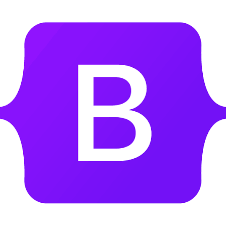

## Why use Bootstrap?
From my experience, using bootstrap is similar to using libraries on any programming language. I haven't used any other UI frameworks similar to Bootstrap but I have found it useful so far. I believe that using raw HTML and CSS would be similar to using C without any additional libraries from my experience. Bootstrap allows you to use prewritten CSS classes instead of developing them on your own. Another area of Boostrap is the icons, I find it very convinient to import all of the icons by adding a link and you can implement an icon just by locating the name. The bootstrap icons and classes are very similar, they both allow you to implement code that is already developed and tested by adding a link to the bootstrap versiona and using the class or icon name.

## My Experience
Using bootstrap has been very useful rather than using raw HTML and CSS. For everytime I implement a class including navbar, container, or button it saves me time. If I was unable to use bootstrap I would have to right every class that I use in bootstrap myself, which can add up over time. The only major downside of using bootstrap is if I'm not allowed to use bootstrap in the future and if it's a requirement to utilize raw HTML and CSS. Using bootstrap makes the use of mainly CSS easier because it minimizes the use of CSS by implementing premade classes.

## Typescript expectations
I didn't have any prior experience using typescript but learning the basics of javascript in the earlier assignment was also useful for learning typescript because you can just use javascript in types[...]

## Athletic Software Engineering 
I believe that the Athletic Software Engineering appraoch is useful to gaining the skills that are expected. Instead of having on homework assignment a week and spending a lot of time creating a whole[...]

## WOD
In the description of the WOD it says that skills in being correct and being efficient would be improved. I believe that these are the two most important skills in software engineering because if your[...]

## Conclusion
I think that I can typescript is a good tool for this course and in software engineering becasue it has many features and simple to pick up at the beginning. I believe that I will be able to practice [...]
