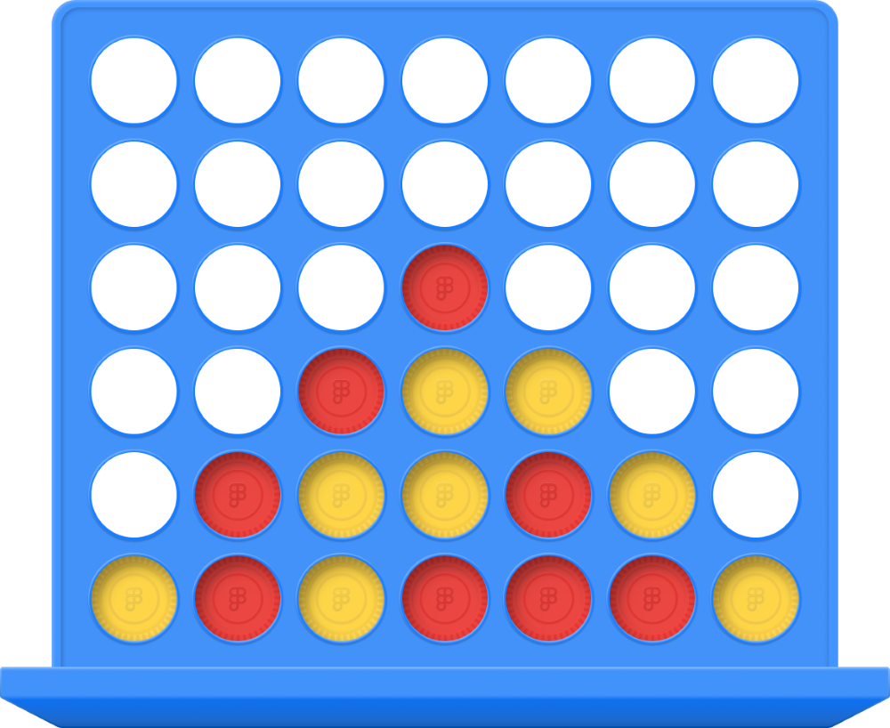
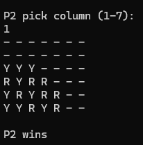

This was one of the first times I fully built a program and game. Although there it is simple you are still able to play the game like you would in person but on a program. There isn't any graphic[...]

  

I just used a 2D array to make the board to play on then to get the "gravity" part of the chips to work I checked if they were out of bounds of the 2D array or if there was a chip below them to no[...]
